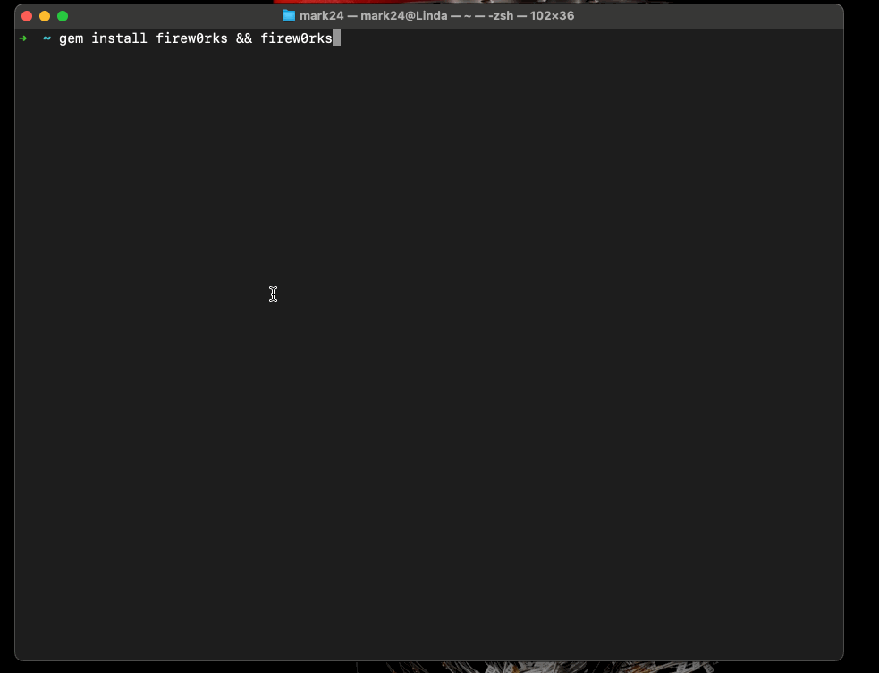

# Firew0rks

Play fireworks text art animations in your terminal!

## Installation

`$ gem install firew0rks`

## Usage

1) Run program

`$ firew0rks`

2) Quit

`Ctrl + C`

## Acknowledgments
This project is a Ruby version of [text_art_animations](https://github.com/rvizzz/text_art_animations) by rvizzz. Thank you for the inspiration and the amazing ASCII art animations!

## Contributing

Bug reports and pull requests are welcome on GitHub at https://github.com/Mark24Code/firew0rks.

## License

The gem is available as open source under the terms of the [MIT License](https://opensource.org/licenses/MIT).
